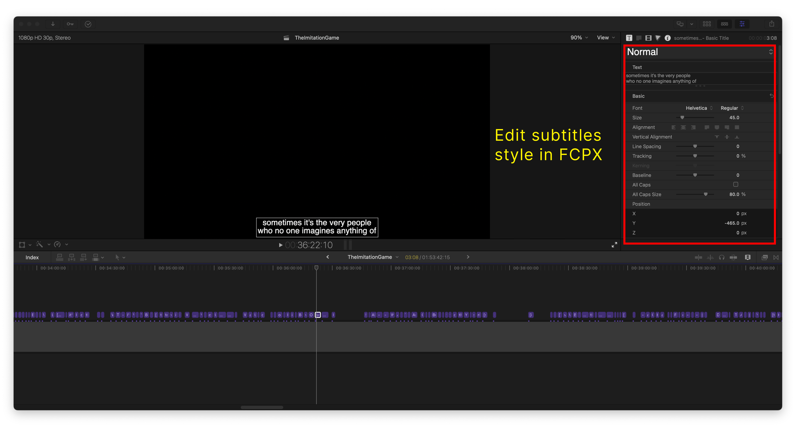

# srt2subtitles 

> Generate editable video subtitles in Final Cut Pro from a SRT file.

Imagine you are using Final Cut Pro to edit videos and want to add built-in subtitles. You may utilize AI audio transcription tools like [Whisper](https://openai.com/research/whisper), [MacWhisper](https://goodsnooze.gumroad.com/l/macwhisper), [Aiko](https://sindresorhus.com/aiko) or any online audio transcription platform, you will get SRT files. **SRT files in [Final Cut Pro](https://www.apple.com/au/final-cut-pro/) cannot be edited** for subtitle text style and timing, unlike software such as [Premiere Pro](https://www.adobe.com/au/lead/creativecloud/premiere.html?), [DaVinci Resolve](https://www.blackmagicdesign.com/products/davinciresolve), and [Sony Vegas](https://www.vegascreativesoftware.com/us/vegas-pro/). Final Cut Pro does not provide the capability to edit the style of subtitles within the software. Manually changing the text content and timing of SRT files can be time-consuming. To efficiently batch process AI subtitles and edit their style, such as font, size, position, borders, shadows, etc., the best approach is to make the changes within Final Cut Pro itself. **srt2subtitles** provides the quickest way to convert SRT files into fcpxml files that can be edited for subtitle style within Final Cut Pro. Simply run the command line and open the fcpxml file in Final Cut Pro.


## Install

Ensure you have [Node.js](https://nodejs.org) 14 or later installed. Then run the following:

```sh
npm install --global srt2subtitles
```

## Usage
```
$ srt2subtitles --help
  Generate editable video subtitles in Final Cut Pro from a SRT file.
  Usage
	$ srt2subtitles <srt> <fps> [destination]
	$ srt2subtitles <srt> <fps> [destination]
  Examples
	$ srt2subtitles TheImitationGame.srt 25
	$ srt2subtitles TheImitationGame.srt 29.97 ./subtitles/
```


## Subtitles in Final Cut Pro




